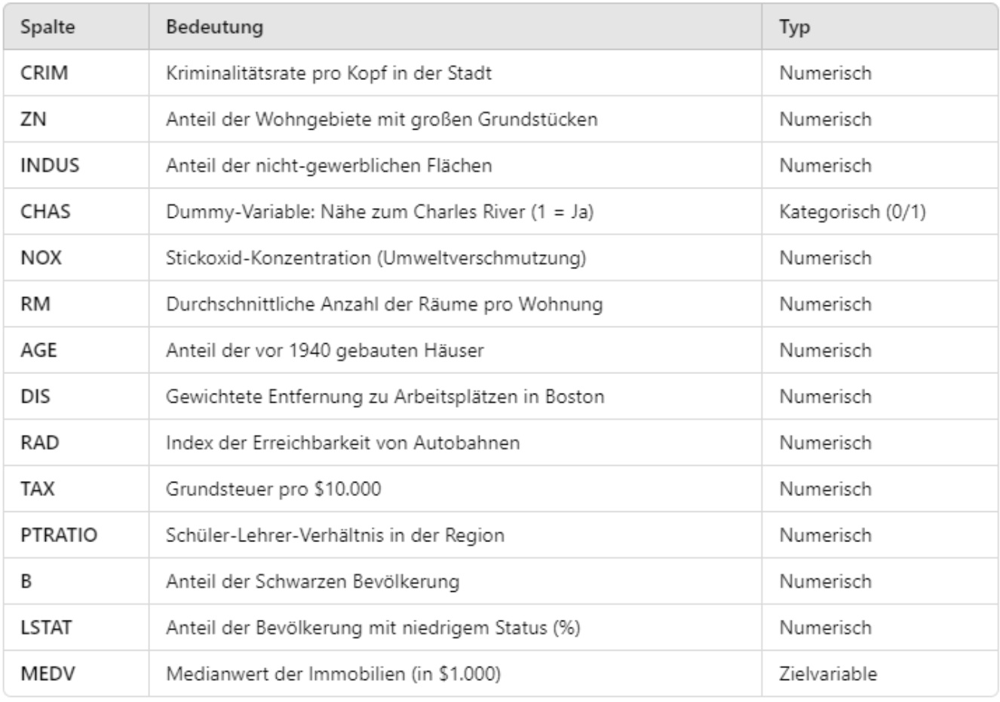

```{r setup, include=FALSE}
require(RAppArmor) 
library(learnr)
library(gradethis)
library(shiny)
library(ggplot2)
library(MASS)

# Boston Housing Dataset laden
boston_housing <- as.data.frame(Boston)

rmarkdown::find_pandoc(cache = FALSE)
knitr::opts_chunk$set(echo = FALSE)

gradethis_setup()
```

## Einleitung

Für dieses Lern-Dashboard nehmen wir an, dass wir Immobilienmakler sind und uns über die Daten des Boston Housing Datensatz [5] informieren wollen. Wir werden uns dazu mit linearer Regression beschäftigen.

Uns wurde bereits gesagt, dass es qualitative und quantitative Merkmale bei den Daten zu den Immobilien geben kann. Qualitative Merkmale sind keine Zahlen, sondern zum Beispiel Farben oder Namen. Quantitative Merkmale sind in Zahlen ausdrückbar und können wie die Zahlen auf einem Lineal geordnet werden.

Als Makler wollen wir zuerst wissen, was der Boston Housing Datensatz für Werte hat.
Bitte ergänzen Sie den R Code, sodass die ersten Zehn Einträge des Boston Housing Datensatzes angezeigt werden. Der Datensatz ist für die Programmieraufgaben als: "boston_housing" nutzbar. Die Funktion die Sie benutzen sollten heißt head.

```{r boston_head, exercise=TRUE, exercise.timelimit=5, exercise.blanks = "___+"}
___(boston_housing, 10)
```

```{r boston_head-solution, exercise.eval=FALSE, include=FALSE}
head(boston_housing, 10)
```

```{r rm-head}
question_numeric("Wie lautet der erste rm Wert?",
  answer(6.575, correct = TRUE),
  allow_retry = TRUE
)
```

Regression ist eine statistische Methode, um vorherzusagen und zu analysieren, wie sich Variablen zueinander verhalten.

Die lineare Regression ist eine von vielen möglichen Regressionsanalysen (z. B. binär logistische Regression) und kann als einfache lineare Regression oder multiple lineare Regression angewandt werden. Bei der einfachen linearen Regression werden lediglich zwei Variablen im Modell berücksichtigt: eine unabhängige (erklärende) und eine abhängige (erklärte) Variable. Hingegen basiert die multiple lineare Regression auf zwei oder mehr unabhängigen Variablen, um die abhängige Variable zu erklären. [7]

Die Bezeichnung Regression stammt von dem englischen Naturforscher Francis Galton (1822-1911), ein Cousin Charles Darwins.
Galton untersuchte die Beziehung der Körpergröße von Vätern und ihren Söhnen. [10]

Bei der einfachen linearen Regression ist die unabhängige Variable der x-Wert und die abhängige Variable der y-Wert im Koordinatensystem bzw. Plot.

Die folgende Darstellung zeigt eine Tabelle [1] mit der Datenstruktur vom Boston Housing Datensatz, der in diesem Dashboard verwendet wird,

{height="600px"}

Als nächstes schauen wir uns zwei Darstellungen an. Ein Plot des Attributes rm (durchschnittliche Anzahl der Räume pro Wohnung) in Bezug auf das Attribut medv (Medianwert der Immobilie (in $1000)) des Boston Housing Datensatzes mit Regressionsgerade an. Und eine Summary des Programm R des Attributes rm in Bezug auf das Attribut medv des Boston Housing Datensatzes.

```{r boston-regression, echo=FALSE}
# Lineares Regressionsmodell erstellen: medv als Funktion von rm
model <- lm(medv ~ rm, data = boston_housing)

# Streudiagramm und Regressionsgerade plotten
plot(boston_housing$rm, boston_housing$medv, 
     main = "Regression von medv auf rm",
     xlab = "Durchschnittliche Anzahl der Zimmer (rm)",
     ylab = "Medianwert von Wohneigentum (medv)",
     pch = 19, col = "blue")  # Streudiagramm der Daten
abline(model, col = "red", lwd = 2)  # Regressionsgerade in rot

# Zusammenfassung des Modells anzeigen
summary(model)
```

```{r rm}
question("Über welches Attribut aus dem Boston Housing Datensatz wird in der Summary eine Aussage getroffen? Der angezeigte Wert ist 9.102",
  answer("dis"),
  answer("nox"),
  answer("zn"),
  answer("rm", correct = TRUE),
  allow_retry = TRUE
)
```

Das verhalten der Werte in dem Plot mit der Regressionsgeraden (rote Gerade) könnte einem Muster folgen.

Wenn wir verschiedene Werte in einem Koordinatensystem bzw. Plot dargestellt haben, können wir überlegen, ob es eine Abhängigkeit der y-Werte von den x-Werten gibt. Falls wir so eine Abhängigkeit sehen, können wir eventuell eine Gerade, die Regressionsgerade, einzeichnen, die die Abhängigkeit beschreibt. Damit ist gemeint, dass die Werte sich im Durchschnitt ansteigend oder absteigend bei Erhöhung der x-Werte (unabhängige Variable) verhalten.

Die folgende Aufgabe ist nicht ganz einfach (eine Knobelaufgabe), aber wenn ich Ihnen den Tipp gebe, dass Sie überlegen, ob Mittelwert, Median oder eines der Quartile den für die Regressionsgerade wichtigen "Mittelpunkt" darstellt, kommen Sie vielleicht auf die Lösung. Gucken Sie sich zur Unterstützung die Regressionsgerade (rote Gerade) in dem Plot oben an. Ein weiterer Hinweis ist, welcher der angegebenen Punkte liegt überhaupt auf der Regressionsgeraden?
 
```{r mittelwert}
question("Was ist die Bedeutung von Regression in der Statistik?",
  answer("Das die durch die Regressionsgleichung berechneten y-Werte näher am ersten Quartil liegen als die gemessenen oder beobachteten Werte."),
  answer("Das die durch die Regressionsgleichung berechneten y-Werte näher am Mittelwert liegen als die gemessenen oder beobachteten Werte.", correct = TRUE),
  answer("Das die durch die Regressionsgleichung berechneten y-Werte näher am Median liegen als die gemessenen oder beobachteten Werte."),
  answer("Das die durch die Regressionsgleichung berechneten y-Werte näher am dritten Quartil liegen als die gemessenen oder beobachteten Werte."),
  allow_retry = TRUE
)
```

## lineare Regression

Die Abhängigkeit der abhängigen Werte der y-Achse von den unabhängigen Werten der x-Achse kann grafisch dargestellt werden, durch eine Gerade. 
Diese Gerade wird Regressionsgerade genannt.

Wir wollen nun versuchen, den Wert einer Immobilie an Hand der vorhandenen Zimmer zu schätzen indem Wir im Koordinatensystem bzw. Plot ablesen. Die vorhandenen Zimmer sind die Variable rm aus dem Boston Housing Datensatz und der Wert der Immobilie ist die Variable medv.

Ein Kollege möchte, dass Sie ein Plot erstellen mit den Attributen rm als abhängige Variable und medv als unabhängige Variable vom Boston Housing Datensatz, wie er in dem Tab "Einleitung" angezeigt wurde, mit der Funktion geom_point() um die Werte einzutragen und geom_smooth() um die Regressionsgerade zu zeichnen.

Die Aufgabe ist mit Kommentaren versehen, die Ihnen helfen sollten.

```{r boston_rm, exercise=TRUE, exercise.timelimit=5, exercise.blanks = "___+"}
ggplot(boston_housing, aes(___, ___)) + # unabhängige Variable, abhängige Variable
    ___() +  # "geom_..." um die Werte einzutragen
    ___(method = "lm", color = "red") +  # "geom_..." für Regressionsgerade
    theme_minimal()
```

```{r boston_rm-solution, exercise.eval=FALSE, include=FALSE}
ggplot(boston_housing, aes(rm, medv)) +
    geom_point() +  # "geom_..." um die Werte einzutragen
    geom_smooth(method = "lm", color = "red") + # "geom_..." für Regressionsgerade
    theme_minimal()
```

```{r ablesen}
question("Eine Wohnung mit sechs Räumen hat einen Wert von ca.? medv ist der Medianwert der Immobilie (in $1000) ",
  answer("15000$"),
  answer("20000$", correct = TRUE),
  answer("25000$"),
  answer("30000$"),
  allow_retry = TRUE
)
```
Mathematisch hat die Gerade die Formel: $f(x)=a \cdot x + b$

Weil die Werte in der Grafik, welche Sie gerade erstellt haben, und die Werte anderer Beispiele nicht immer genau auf der Regressionsgeraden liegen, ist es wichtig in der Formel anzugeben, dass die Werte von der Regressionsgeraden abweichen können. Es wird eine Variable u für dieses Abweichen (der sogenannte Fehler) eingefügt, sodass die Formel lautet: $y_i = a \cdot x_i + b + u_i$. 

b gibt den Achsenabschnitt an, also den Schnittpunkt der Regressionsgeraden mit der y-Achse für den Wert: $x_i = 0$ an.

```{r Schnittpunkt}
# Erstellen des linearen Modells
model <- lm(medv ~ rm, data = boston_housing)

# Berechnung des y-Achsen-Schnittpunkts (bei x = 0)
y_intercept <- coef(model)[1] # Intercept der Regressionsgeraden

# Erstellen des Scatterplots mit angepasstem Bereich für x und y
plot(boston_housing$rm, boston_housing$medv, 
     xlab = "Anzahl der Zimmer (rm)", 
     ylab = "Medianwert der Häuser (medv)", 
     main = "Schnittpunkt mit der y-Achse ist rot (x=0)", 
     pch = 16, col = "blue",
     xlim = c(0, max(boston_housing$rm)),       # x-Bereich erweitern, damit x = 0 sichtbar ist
     ylim = c(min(c(boston_housing$medv, y_intercept)) - 10, max(boston_housing$medv))) # y-Bereich erweitern

# Hinzufügen der Regressionsgeraden
abline(model, col = "green", lwd = 2)

# Hinzufügen eines grünen Rings bei x = 0 (y = Schnittpunkt der Regressionsgeraden)
points(x = 0, y = y_intercept, 
       pch = 1, cex = 3, col = "red")
```

```{r a_und_b}
question("Welche Aussage über a und b ist richtig?",
  answer("a bezeichnen wir als die Modellkonstante und b als den Steigungsparameter. b gibt an, um wie viele Einheiten sich verändert, 
wenn  bei Konstanthaltung aller anderen Einflussgrößen (hier also $u_i$) um eine Einheit steigt."),
  answer("b bezeichnen wir als die Modellkonstante und a als den Steigungsparameter. a gibt an, um wie viele Einheiten sich verändert, 
wenn  bei Konstanthaltung aller anderen Einflussgrößen (hier also $u_i$) um eine Einheit steigt. [6]", correct = TRUE),
  allow_retry = TRUE
)
```

Der Fehler u ist die Entfernung von der Regressionsgeraden zum wahren Wert (x|y) parallel zur Y-Achse. $u_i = y_i - \hat{y}_i$

Die folgende Grafik zeigt die Werte der Fehler mit grünen Linien.

```{r boston-error, echo=FALSE}
model <- lm(medv ~ rm, data = boston_housing)
plot(boston_housing$rm, boston_housing$medv, 
     main = "Regression von medv auf rm",
     xlab = "Durchschnittliche Anzahl der Zimmer (rm)",
     ylab = "Medianwert von Wohneigentum (medv)",
     pch = 19, col = "blue")  # Streudiagramm der Daten
abline(model, col = "red", lwd = 2)  # Regressionsgerade in rot
predicted <- predict(model)
segments(x0 = boston_housing$rm,  # x-Werte der Punkte
         y0 = boston_housing$medv,  # tatsächliche y-Werte
         x1 = boston_housing$rm,  # gleiche x-Werte
         y1 = predicted,  # vorhergesagte y-Werte
         col = "green", lwd = 1)  # Residuenlinien in grün
```

Wir wollen als Immobilienmakler zeigen, dass die vom Computer berechnete Regressionsgerade den Fehler gleichmäßig um sich streuen läßt.
Programmieren Sie dazu bitte für das Beispiel Boston Housing die standardisierten Residuen. Die grafische Darstellung weicht vom Unterricht ab, es ist aber eine gute Visualisierung, der um die Regressionsgerade streuenden Werte.

```{r boston_sr, exercise=TRUE, exercise.timelimit=5, exercise.blanks = "___+"}
model <- lm(medv ~ rm, data = boston_housing)
resid_std <- rstandard(model)
plot(boston_housing$___, resid_std, # unabhängige Variable
     pch = 20,
     col = "blue",
     xlab = "Prädiktorvariable (x)",
     ylab = "Standardisierte Residuen",
     main = "Standardisierte Residuen um die Regressionsgerade")
abline(h = 0, col = "red", lwd = 2)
```

```{r boston_sr-solution, exercise.eval=FALSE, include=FALSE}
model <- lm(medv ~ rm, data = boston_housing)
resid_std <- rstandard(model)
plot(boston_housing$medv, resid_std,
     pch = 20,
     col = "blue",
     xlab = "Prädiktorvariable (x)",
     ylab = "Standardisierte Residuen",
     main = "Standardisierte Residuen um die Regressionsgerade")
abline(h = 0, col = "red", lwd = 2)
```

Ein Kollege des Immobilienbüros hat Ihnen eine Frage gestellt. Können Sie diese beantworten?

```{r sr}
question("Was ist an der Darstellung der Standardisierte Residuen anders im Gegensatz zu dem normalen Plot?",
  answer("Wie in dem Programm-Code zu sehen, wurde die Grafik um 20 Grad gedreht (pch), damit die Regressionsgerade auf der x-Achse liegt."),
  answer("Die abhängige und unabhängige Variable wurden ausgetauscht."),
  answer("Die Regressionsgerade verläuft als x-Achse und im positiven und negativen Bereich der y-Achse werden die Abweichungen der Werte von der Regressionsgeraden dargestellt.", correct = TRUE),
  allow_retry = TRUE
)
```

Anwendungsbereiche für lineare Regression sind unter anderem das Untersuchen von Zusammenhängen zwischen Variablen und Prognosemodelle, um zum Beispiel mit einer Regressionsgeraden Werte vorherzusagen.

Aus dem Matheunterricht wissen wir, dass die Änderung des y-Wertes geteilt durch die Änderung des x-Wertes von zwei verschiedenen Punkten der Anstieg einer Gerade, die durch beide Punkte verläuft, ist. $$a=\frac{\Delta y}{\Delta x}$$

Ganz so einfach kann die Regressionsgerade nicht ermittelt werden, aber die Erklärung für die Regressionsgerade ist nicht schwer, sondern nur aufwendig in den Taschenrechner einzugeben, wenn man mit Hand rechnen muss.

Um die Regressionsgerade zu berechnen, wird das arithmetische Mittel benötigt, um die mittlere quadratische Abweichung und die Kovarianz zu berechnen. 

Diese Erklärung der Berechnung ist für einfache lineare Regression mit einer unabhängigen Variablen.

arithmetisches Mittel:  $$\bar{x}=\frac{1}{n} \sum_{i=1}^{n} x_i$$

mittlere quadratische Abweichung bzw. Standardabweichung: $$s^2_x=\frac{1}{n} \sum_{i=1}^{n} (x_i-\bar{x})^2$$ $$s^2_y=\frac{1}{n} \sum_{i=1}^{n} (y_i-\bar{y})^2$$

Kovarianz: $$s_{xy}=\frac{1}{n} \sum_{i=1}^{n} (x_i-\bar{x}) \cdot (y_i-\bar{y})$$

Mit diesen Werten lassen sich dann $\hat{a}$ und $\hat{b}$ der Regressionsgeraden ermitteln, indem in die folgenden Formeln eingesetzt wird: $$\hat{a}=\frac{s_{xy}}{s^2_x}$$
$$\hat{b}=\bar{y} - \hat{a} \cdot \bar{x}$$

Zur Schreibweise: Das Dachˆ über b bzw. über a weist darauf hin, dass es sich um Schätzer für die unbekannten Modellparameter b und a handelt. [4]

Der zuvor erwähnte Fehler u ist für die Regressionsgerade nicht wichtig. Er ist wegen der Korrektheit der Formel wichtig, weil die Werte eben nicht immer auf der Regressionsgeraden liegen.

Programmieren Sie bitte ein ggPlot mit Konfidenzband für den Boston Housing Datensatz und benutzen Sie die Variable rm als unabhängige Variable und medv als abhängige Variable. Der Kunde sagte, dass Sie ihm bitte die Werte zeigen, die die Regressionsgerade zu 95% hat. Welch ein Zufall, dass die Standardeinstellung des Konfidenzbandes genau 95% Genauigkeit der Regressionsgeraden anzeigt.

```{r boston_ggP, exercise=TRUE, exercise.timelimit=5, exercise.blanks = "___+"}
___ <- data.frame(rm = boston_housing$rm, ___ = boston_housing$medv) # Data Frame auf Objekt übergeben
ggplot(___, aes(x = rm, y = medv)) + # Objekt laden
    geom_point(color = "blue", size = 2) +
    geom_smooth(method = "lm", color = "red", se = ___) + # se ist das Konfidenzband FALSE/TRUE
    labs(
        title = "Streudiagramm mit Regressionsgerade",
        x = "Durchschnittliche Anzahl der Räume (rm)",
        y = "Medianwert der Häuserpreise (medv)"
    ) + 
    theme_minimal()
```

```{r boston_ggP-solution, exercise.eval=FALSE, include=FALSE}
data <- data.frame(rm = boston_housing$rm, medv = boston_housing$medv)
ggplot(data, aes(x = rm, y = medv)) + 
    geom_point(color = "blue", size = 2) +
    geom_smooth(method = "lm", color = "red", se = TRUE) +
    labs(
        title = "Streudiagramm mit Regressionsgerade",
        x = "Durchschnittliche Anzahl der Räume (rm)",
        y = "Medianwert der Häuserpreise (medv)"
    ) + 
    theme_minimal()
```

An der Regressionsgeraden lässt sich ablesen, ob einen Zusammenhang zwischen den Werten der x-Achse und denen der y-Achse besteht.

Dies kann man mit dem Determinationskoeffizient (r²) und dem Bravais-Person Korrelationskoeffizient (r) genauer bestimmen.

Hat man einen signifikanten Beitrag der endogenen Variablen x zur Erklärung der Zielvariablen y festgestellt, kann man die Höhe des Beitrages quantifizieren. Die Maßzahl dafür heißt Determinationskoeffizient (r²). Genauer gibt der Determinationskoeffizient den Anteil der Variationen von y an, der durch den linearen Einfluss von x erklärbar ist. [4]

Determinationskoeffizient: $$r^2 = \frac{\sum_{i=1}^{n} (\hat{y}_i - \bar{y})^2}{\sum_{i=1}^{n} (y_i - \bar{y})^2} = \frac{\sum_{i=1}^{n} (y_i - \hat{y})^2}{\sum_{i=1}^{n} (y_i - \bar{y})^2}$$ 

Ein Determinationskoeffizient von 0,6 bedeutet, dass 60% der Werte der abhängigen Variablen y von der unabhängigen Variablen x erklärt werden können. 
Dementsprechend sind die restlichen 40% durch den Fehler u zu erklären.

Der Bravais-Person Korrelationskoeffizient ist die Kovarianz geteilt durch die Wurzel des Produkts von der Standardabweichung von x und der Standardabweichung von y.

Bravais-Person Korrelationskoeffizient: $$r= \frac{\sum_{i=1}^{n} (x_i-\bar{x}) \cdot (y_i-\bar{y})}{\sqrt{\sum_{i=1}^{n} (x_i-\bar{x})^2 \cdot \sum_{i=1}^{n} (y_i-\bar{y})^2}}$$

Der Bravais-Person Korrelationskoeffizient (r) von +1 sagt, dass die Regressionsgerade eine Steigung hat und die Werte genau auf der Regressionsgeraden liegen und -1 bedeutet, dass die Regressionsgerade ein Gefälle hat und die Werte genau auf der Regressionsgeraden liegen. Der Determinationskoeffizient (r²) hingegen gibt Aufschluss, wie sehr die Werte auf der Regressionsgeraden liegen, sagt aber nichts über die Steigung aus.

```{r r_und_r2}
question("Ist der Korrelationskoeffizient r die Wurzel aus dem Determinationskoeffizient r²?",
  answer("Das ist wahr."),
  answer("Das ist falsch.", correct = TRUE),
  allow_retry = TRUE
)
```

Die Regressionsgerade ist nur aufschlussreich / anwendbar für den Bereich, für den auch Messwerte vorhanden sind. Liegen für einen Bereich keine Messwerte vor, dann kann das Modell nicht zum Voraussagen der entsprechenden Werte genutzt werden. Das gleiche trifft zu, wenn die Regressionsgerade in den negativen Wertebereich der y-Achse sein sollte und es keine negativen y-Werte geben kann.

Um mehrere Variablen Einfluss auf den y-Wert nehmen zu lassen, können diese weiteren Variablen in die Funktion $y_i = a \cdot x_i + b + u_i$ eingesetzt werden. Zum Beispiel durch das Einsetzen einer weiteren unabhängigen Variablen, heißt die Formel: $y_i = a \cdot x_i + c \cdot z_i + b + u_i$. Hier wurde $c \cdot z_i$! eingefügt. Für $x_i$ und $z_i$ sind die Werte der unabhängigen Variablen einzusetzen und a und c sind die Faktoren für die Werte der unabhängigen Variablen, welche durch die Regressionsgeraden vorgegeben sind.

Bitte vervollständigen Sie den Code des ggplot. Der Kollege wünscht diese Information.

```{r boston_zwei, exercise=TRUE, exercise.timelimit=5, exercise.blanks = "___+"}
___(boston_housing, aes(x = rm, y = medv)) + # Welchen Plot möchte ich starten
    geom_point(aes(color = lstat), size = 2) +
    geom_smooth(
        method = "lm",
        formula = y ~ ___,
        aes(group = 1),
        se = ___, # Konfidenzband
        linewidth = 1 
    ) + 
    labs(
        title = "Multiple Regression: Vorhersage von medv basierend auf rm und lstat",
        x = "Durchschnittliche Anzahl der Räume (rm)",
        y = "Medianwert der Häuserpreise (medv)",
        color = "LSTAT (%)"
    ) + 
    theme_minimal()

```

```{r boston_zwei-solution, exercise.eval=FALSE, include=FALSE}
ggplot(boston_housing, aes(x = rm, y = medv)) + 
    geom_point(aes(color = lstat), size = 2) +  # Punkte mit lstat als Farbverlauf
    geom_smooth(
        method = "lm",
        formula = y ~ x,
        aes(group = 1),  # Gruppierung hinzufügen, um die Regressionsgerade korrekt zu zeichnen
        se = FALSE,
        linewidth = 1    # Statt size das neue linewidth-Argument verwenden
    ) + 
    labs(
        title = "Multiple Regression: Vorhersage von medv basierend auf rm und lstat",
        x = "Durchschnittliche Anzahl der Räume (rm)",
        y = "Medianwert der Häuserpreise (medv)",
        color = "LSTAT (%)"
    ) + 
    theme_minimal()

```

Wie sie sehen, haben sich die Werte in der Grafik, im Gegensatz zu dem Plot mit nur einer Variablen, nicht geändert. Es ist leider nicht möglich in R eine Grafik mit zwei unabhängigen Variablen als eine Regressionsgerade zu plotten. Stattdessen wurde der Einfluss der unabhängigen Variablen lstat in der Grafik farbig dargestellt.

Die Berechnung durch eine Summary ist aber möglich. Bitte ergänzen Sie den Code, um die Summary für rm, lstat und medv zu zeigen. medv ist wie immer die abhängige Variable. Der Kollege fand das Missgeschick, dass das Programm etwas nicht kann übrigens nicht so lustig und fragte, wie Sie es Ihm erklären wollen.

```{r boston_summary, exercise=TRUE, exercise.timelimit=5, exercise.blanks = "___+"}
# Lineares Regressionsmodell anpassen
model <- lm(___ ~ rm + ____, data = boston_housing)

# Zusammenfassung des Modells anzeigen
summary(___)
```

```{r boston_summary-solution, exercise.eval=FALSE, include=FALSE}
# Lineares Regressionsmodell anpassen
model <- lm(medv ~ rm + lstat, data = boston_housing)

# Zusammenfassung des Modells anzeigen
summary(model)
```

```{r interceptor}
question_numeric("Wie lautet der Schnittpunkt mit der Y-Achse?",
  answer(-1.35827, correct = TRUE),
  allow_retry = TRUE
)
```

```{r steigung}
question_numeric("Wie groß ist der Anstieg von rm?",
  answer(5.09479, correct = TRUE),
  allow_retry = TRUE
)
```

Der Standardfehler ist die Wurzel der Standardabweichung von x geteilt durch die Wurzel von n, dadurch lässt sich die Genauigkeit des
Schätzverfahrens an der Varianz der Schätzstatistik festmachen. [3]

Standardfehler: $$\hat{\sigma}_{\bar{x}} = \frac{\sqrt{s_x^2}}{\sqrt{n}}$$

Programmieren Sie bitte am Beispiel Boston Housing das Normal-Quantil-Plot der Residuen (Normalverteilungsannahme), um dem Kunden des Immobilienbüros zu zeigen, wie r und r² grafisch dargestellt aussehen.

```{r boston_nqp, exercise=TRUE, exercise.timelimit=5, exercise.blanks = "___+"}
___ <- lm(medv ~ rm, data = boston_housing)
___ <- resid(model) 
qqnorm(residuen, 
       pch = 20, # Punktform
       col = "blue", # Farbe der Punkte
       main = "Normal-Quantil-Plot der Residuen",
       xlab = "Theoretische Quantile",
       ylab = "Residuen")
qqline(residuen, col = "red", lwd = 2) # Gerade für Normalverteilung hinzufügen
```

```{r boston_nqp-solution, exercise.eval=FALSE, include=FALSE}
model <- lm(medv ~ rm, data = boston_housing)
residuen <- resid(model) 
qqnorm(residuen, 
       pch = 20, # Punktform
       col = "blue", # Farbe der Punkte
       main = "Normal-Quantil-Plot der Residuen",
       xlab = "Theoretische Quantile",
       ylab = "Residuen")
qqline(residuen, col = "red", lwd = 2) # Gerade für Normalverteilung hinzufügen
```

Bei dem Normal-Quantil-Plot sollten die Werte annähernd alle auf einer Linie liegen, sonst ist die Normalverteilung nicht gegeben.
Für die Normalverteilung gilt, dass rund Zweidrittel aller Messwerte innerhalb der Entfernung einer Standardabweichung zum Mittelwert liegen. [2]
Die Normalverteilung ist wichtig für statistische Schätzungen und Tests des Modells. Ist die Normalverteilung nicht erfüllt, kann es zu unzuverlässigen Testergebnissen kommen.

Als Abschluss können Sie sich noch anschauen und dem Kunden erklären, wie sich der Fehlerwert verändert, wenn Sie die Regressionsgerade nach oben oder unter verschieben.

```{r}
fluidRow(
  column(8, 
         plotOutput("housing_plot"),     # Plot der Regressionsgeraden
         verbatimTextOutput("error_output")  # Fehleranzeige unter dem Plot
  ),
  column(4,
         sliderInput("slider_shift", "Verschiebung der Regressionsgeraden (nach oben/unten):",
                     min = -10, max = 10, value = 0, step = 0.1),  # Schieberegler
         plotOutput("error_plot")            # Fehlerplot rechts vom Hauptplot
  )
)
```

```{r, context="server"}
# Server-Code für interaktiven Inhalt
output$housing_plot <- renderPlot({
  # Boston Housing Daten laden
  data("Boston", package = "MASS")
  
  # Lineares Regressionsmodell für rm (Anzahl der Räume) und medv (Häuserpreise)
  model <- lm(medv ~ rm, data = Boston)
  
  # Schiebereglerwert auslesen
  shift <- input$slider_shift
  
  # Vorhersagen basierend auf dem Modell
  Boston$predicted <- predict(model, newdata = Boston)
  
  # Verschobene Regressionsgerade
  Boston$shifted <- Boston$predicted + shift
  
  # Plot generieren
  ggplot(Boston, aes(x = rm, y = medv)) +
    geom_point(alpha = 0.6) +
    geom_line(aes(y = predicted), color = "blue", linetype = "dashed", linewidth = 1) +
    geom_line(aes(y = shifted), color = "red", linewidth = 1) +
    labs(
      x = "Anzahl der Räume (RM)",
      y = "Median der Häuserpreise (MEDV)",
      title = "Boston Housing: RM vs. MEDV",
      subtitle = sprintf("Verschiebung der Regressionsgeraden: %.1f", shift)
    ) +
    theme_minimal()
})

output$error_plot <- renderPlot({
  # Boston Housing Daten laden
  data("Boston", package = "MASS")
  
  # Lineares Regressionsmodell für rm (Anzahl der Räume) und medv (Häuserpreise)
  model <- lm(medv ~ rm, data = Boston)
  
  # Fehlerberechnung über einen Bereich von Verschiebungen
  shifts <- seq(-10, 10, by = 0.1)
  mse_values <- sapply(shifts, function(shift) {
    predicted <- predict(model, newdata = Boston) + shift
    mean((Boston$medv - predicted)^2)
  })
  
  # Daten für Fehlerplot
  error_df <- data.frame(shift = shifts, mse = mse_values)
  
  # Fehlerplot erstellen
  ggplot(error_df, aes(x = shift, y = mse)) +
    geom_line(color = "darkred", linewidth = 1) +
    geom_vline(xintercept = input$slider_shift, linetype = "dashed", color = "blue") +
    labs(
      x = "Verschiebung der Regressionsgeraden",
      y = "Mittlerer quadratischer Fehler (MSE)",
      title = "Fehler durch Verschiebung der Regressionsgeraden",
      subtitle = sprintf("Aktuelle Verschiebung: %.1f", input$slider_shift)
    ) +
    theme_minimal()
})

output$error_output <- renderText({
  # Boston Housing Daten laden
  data("Boston", package = "MASS")
  
  # Lineares Regressionsmodell für rm (Anzahl der Räume) und medv (Häuserpreise)
  model <- lm(medv ~ rm, data = Boston)
  
  # Schiebereglerwert auslesen
  shift <- input$slider_shift
  
  # Vorhersagen mit Original- und verschobener Regressionsgerade
  Boston$predicted <- predict(model, newdata = Boston)
  Boston$shifted <- Boston$predicted + shift
  
  # Fehlerberechnung (Mittlere quadratische Abweichung)
  mse_original <- mean((Boston$medv - Boston$predicted)^2)
  mse_shifted <- mean((Boston$medv - Boston$shifted)^2)
  error_diff <- mse_shifted - mse_original
  
  # Fehlertext ausgeben
  paste0(
    "Fehler bei der verschobenen Regressionsgeraden:\n",
    sprintf("Originaler Fehler (MSE): %.2f\n", mse_original),
    sprintf("Verschobener Fehler (MSE): %.2f\n", mse_shifted),
    sprintf("Zusätzlicher Fehler: %.2f", error_diff)
  )
})
```

## Umfrage

Wenn Sie sich bitte die Zeit nehmen und an der kurzen Umfrage zu diesem Lern-Dashboard teilnehmen.

Zugang zur Umfrage über den folgenden Link: https://forms.gle/rJaX17vkoQZUJzck7

## Quellen

[1] ChatGPT wurde genutzt für die Übersicht des Boston Housing Datensatzes (Boston-Housing-Overview) und als Hilfe beim Programmieren des R Code.

[2] de.statista.com 2024. Definition Normalverteilung. https://de.statista.com/statistik/lexikon/definition/95/normalverteilung/ [Stand 2024-12-14].

[3] Fahrmeir, Ludwig u. a. 2024. Statistik: Der Weg zur Datenanalyse. 9. Aufl. 2023. Berlin, Heidelberg: Springer Berlin Heidelberg.

[4] Frost, Ira 2018. Einfache lineare Regression: Die Grundlage für komplexe Regressionsmodelle verstehen. Wiesbaden: Springer VS.

[5] MASS, das R Paket liefert den "Boston Housing" Datensatz.

[6] Rottmann, Horst & Auer, Benjamin R. 2010. Ein Überblick über die lineare Regression. WiSt - Wirtschaftswissenschaftliches Studium 39, 11, 548–554.
http://elibrary.vahlen.de/index.php?doi=10.15358/0340-1650-2010-11-548 [Stand 2024-11-29].

[7] Sebastian 2023. Lineare Regression – Funktionsweise und Berechnung mit RStudio. https://www.acad-write.com/ratgeber/statistik-rstudio/lineare-regression-rstudio/ [Stand 2024-12-12].

[8] Urban, Dieter & Mayerl, Jochen 2011. Regressionsanalyse: Theorie, Technik und Anwendung. 4., überabeitete und erweiterte Auflage. Wiesbaden: VS Verlag für Sozialwissenschaften.

[9] Varnhorn, Beate & Lexikoninstitut Bertelsmann (Hg.) 2006. Bertelsmann, Das neue Universallexikon: 70000 Stichwörter und erklärte Begriffe; 100 Tabellen. Gütersloh München: Wissen-Media-Verl.

[10] Weiß, C. 2018. Lineare Regression: Folge 8. Notfall +  Rettungsmedizin 21, 5, 406–408. http://link.springer.com/10.1007/s10049-018-0473-0 [Stand 2024-12-1].


::: data_protection_text
### Autor

Jürgen Willy Lässig

### Projekt

Lern-Dashboard über lineare Regression

### Datenschutz

Der Server des Lern-Dashboard sammelt statistische Daten über die Nutzung des Lern-Dashboard. Diese Daten werden nicht weitergegeben und enthalten keine personenbezogenen Informationen.
:::
