```{r setup, include=FALSE}
require(RAppArmor) 
library(learnr)
library(gradethis)
library(shiny)
library(ggplot2)
library(MASS)

# Boston Housing Dataset laden
boston_housing <- as.data.frame(Boston)

rmarkdown::find_pandoc(cache = FALSE)
knitr::opts_chunk$set(echo = FALSE)

gradethis_setup()
```

## Übersicht

Die folgenden drei Darstellungen zeigen 1. eine Tabelle der Datenstrucktur von Boston Housing, dem Datensatz der in diesem Dashboard verwendet wird,
2. ein Plot des Attributes rm (durchschnittliche Anzahl der Räume pro Wohnung) in Bezug auf das Attribut medv (Medianwert der Immobilie (in $1000)) des Boston Haousing Datensatzes mit Regressionsgerade und 3. eine Summary des Programm R des Attributes rm (durchschnittliche Anzahl der Räume pro Wohnung) in Bezug auf das Attribut medv (Medianwert der Immobilie (in $1000)) des Boston Haousing Datensatzes. 

{height="600px"}
```{r boston-regression, echo=FALSE}
# Lineares Regressionsmodell erstellen: medv als Funktion von rm
model <- lm(medv ~ rm, data = boston_housing)

# Streudiagramm und Regressionsgerade plotten
plot(boston_housing$rm, boston_housing$medv, 
     main = "Regression von medv auf rm",
     xlab = "Durchschnittliche Anzahl der Zimmer (rm)",
     ylab = "Medianwert von Wohneigentum (medv)",
     pch = 19, col = "blue")  # Streudiagramm der Daten
abline(model, col = "red", lwd = 2)  # Regressionsgerade in rot

# Zusammenfassung des Modells anzeigen
summary(model)
```

```{r rm}
question("Über welches Attribut aus dem Boston Housing Datensatz wird in der Summary eine Aussage getroffen?",
  answer("dis"),
  answer("nox"),
  answer("zn"),
  answer("rm", correct = TRUE),
  allow_retry = TRUE
)
```

Lineare Regression ist, dass eine abhängige Variable von einer unabhängigen Variable erklärt wird. 
Mit anderen Worten, die unabhängige Variable auf der x-Achse bedingt den Wert der abhängigen Variable auf der y-Achse.

Die Bezeichnung Regression stammt von dem englischen Naturforscher Francis Galton (1822-1911), ein Cousin Charles Darwins.
Galton untersuchte die Beziehung der Körpergröße von Vätern und ihren Söhnen.
 
```{r mittelwert}
question("Was ist die Bedeutung von Regression in der Statistik?",
  answer("Das die durch die Regressionsgleichung berechneten y-Werte näher am ersten Quartil liegen als die gemessenen oder beobachteten Werte."),
  answer("Das die durch die Regressionsgleichung berechneten y-Werte näher am Mittelwert liegen als die gemessenen oder beobachteten Werte.", correct = TRUE),
  answer("Das die durch die Regressionsgleichung berechneten y-Werte näher am Median liegen als die gemessenen oder beobachteten Werte."),
  answer("Das die durch die Regressionsgleichung berechneten y-Werte näher am dritten Quartil liegen als die gemessenen oder beobachteten Werte."),
  allow_retry = TRUE
)
```

In Tab 1 - "Definition und mathematisches Modell und Voraussetzungen" wird das Erstellen von Grafiken in der Programmiersprache R und mit Regressionsgeraden behandelt und das mathematische Modell der linearen Regression erklärt. Voraussetzungen für die lineare Regression und Anwendungsbereiche werden betrachtet. Nicht alle Voraussetzungen, die aufgeführt sind, werden für den alnalytischen Ansatz benötigt. Der alalytische Ansatz ist die Berechnung der Regressionsgeraden.

In Tab 2 - "Interpretation der Modellparameter und Gütemaße" wird der analytische Ansatz mathematisch erklärt, wie die Regressionsgerade berechnet wird und Sie werden die Berechnung der Regressionsgeraden mit R durchführen. Es wird erklärt, wie die Gütemaße, der Determinationskoeffizient (r²) und der Bravais-Person Korrelationskoeffizient (r) berechnet werden. Die lineare Regression mit mehr als einer unabhängigen Variable wird erklärt.

## Definition und mathematisches Modell und Voraussetzungen

DIe Abhängigkeit der abhängigen Werte der Y-Achse von den unabhängigen Werten der x-Achse kann grafisch dargestellt werden, durch eine Gerade. 
Diese Gerade wird Regressionsgerade genannt.

Ich möchte, dass Sie ein Plot erstellen mit den Attributen rm als abhängige Variable und medv als unabhängige Variable vom Boston Housing Datensatz, wie er in dem Tab "Übersicht" angezeigt wurde, mit der Funktion geom_point() um die Werte einzutragen und geom_smooth() um die Regressionsgerade zu zeichnen.

```{r boston_rm, exercise=TRUE, exercise.timelimit=5, exercise.blanks = "___+"}
ggplot(boston_housing, aes(___, ___)) + # unabhängige Variable, abhängige Variable
    ___ +  # "geom_..." für Linienplot
    ___(method = "lm", color = "red") +  # "geom_..." für Regressionslinie
    theme_minimal()
```

```{r boston_rm-solution, exercise.eval=FALSE, include=FALSE}
ggplot(boston_housing, aes(rm, medv)) +
    geom_point() +  # "geom_..." für Linienplot
    geom_smooth(method = "lm", color = "red") + # "geom_..." für Regressionsgerade
    theme_minimal()
```

Mathematisch hat die Gerade die Formel: 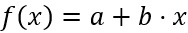{height="40px"}.

Weil die Werte in der Grafik, welche Sie gerade erstellt haben, und die Werte anderer Beispiele nicht immer genau auf der Regressionsgeraden liegen, ist es wichtig in der Formel anzugeben, dass die Werte von der Regressionsgeraden abweichen können. Es wird eine Variable u für dieses Abweichen (der sogenannte Fehler) eingefügt, sodass die Formel lautet: 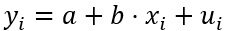{height="40px"}. 

a gibt den Achsenabschnitt an, also den Schnittpunkt der Regressionsgeraden mit der y-Achse für den Wert: 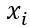{height="40px"}=0 an.

```{r a_und_b}
question("Welche Aussage über a und b ist richtig?",
  answer("b bezeichnen wir als die Modellkonstante und a als den Steigungsparameter. a gibt an, um wie viele Einheiten sich verändert, 
wenn  bei Konstanthaltung aller anderen Einflussgrößen (hier also u_i) um eine Einheit steigt."),
  answer("a bezeichnen wir als die Modellkonstante und b als den Steigungsparameter. b gibt an, um wie viele Einheiten sich verändert, 
wenn  bei Konstanthaltung aller anderen Einflussgrößen (hier also u_i) um eine Einheit steigt.", correct = TRUE),
  allow_retry = TRUE
)
```

Der Fehler u ist die Entfernung von der Regressionsgeraden zum wahren Wert (x|y) parallel zur Y-Achse. 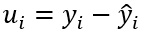{height="40px"}

Die folgende Grafik zeigt den Wert der Fehler mit einer grünen Linie.

```{r boston-error, echo=FALSE}
model <- lm(medv ~ rm, data = boston_housing)
plot(boston_housing$rm, boston_housing$medv, 
     main = "Regression von medv auf rm",
     xlab = "Durchschnittliche Anzahl der Zimmer (rm)",
     ylab = "Medianwert von Wohneigentum (medv)",
     pch = 19, col = "blue")  # Streudiagramm der Daten
abline(model, col = "red", lwd = 2)  # Regressionsgerade in rot
predicted <- predict(model)
segments(x0 = boston_housing$rm,  # x-Werte der Punkte
         y0 = boston_housing$medv,  # tatsächliche y-Werte
         x1 = boston_housing$rm,  # gleiche x-Werte
         y1 = predicted,  # vorhergesagte y-Werte
         col = "green", lwd = 1)  # Residuenlinien in grün
```

Für ein lineares Regressionsmodell gelten folgende fünf Annahmen:

1. Parameterlinearität: Die Parameter der Regressionsfunktion dürfen nur mit Exponent Eins auftauchen und außerdem nicht multiplikativ 
mit anderen Parametern verknüpft sein. Variablenlinearität ist nicht erforderlich.

2. Variation von x: Die n mittels einer Zufallsstichprobe gewonnenen Ausprägungen von x sind nicht alle gleich.

3. Exogenität von x: Der bedingte Erwartungswert (E) des Störterms ist gleich Null, d.h. es gilt {height="40px"}.

4. Homoskedastizität: Die bedingte Varianz des Störterms ist konstant, d.h. 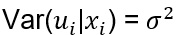{height="40px"}
Schwanken die Residuen regellos um die x-Achse und bleibt ihre Variabilität in einer ungefähr gleichen Bandbreite, können wir von einem konstanten 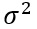{height="40px"} ausgehen.

5. Keine Störtermkorrelation: Die bedingte Kovarianz zwischen zwei beliebigen 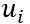{height="40px"} und 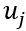{height="40px"} und mit i ungleich j ist gleich Null, d.h. 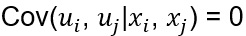{height="40px"}

Korrelation: Wechselbeziehung in der Statistik die wechselseitige Abhängigkeit zweier oder mehrerer Zufallsgrößen.

Programmieren SIe bitte für das Beispiel “Boston Housing” Standardisierte Residuen. Die grafische Darstellung weicht vom Unterricht ab, aber es ist eine gute Visualisierung, der um die Regressionsgerade steuenden Werte.

```{r boston_sr, exercise=TRUE, exercise.timelimit=5, exercise.blanks = "___+"}
model <- lm(medv ~ rm, data = boston_housing)
resid_std <- rstandard(model)
plot(boston_housing$___, resid_std, # unabhängige Variable
     pch = 20,
     col = "blue",
     xlab = "Prädiktorvariable (x)",
     ylab = "Standardisierte Residuen",
     main = "Standardisierte Residuen um die Regressionsgerade")
abline(h = 0, col = "red", lwd = 2)
```

```{r boston_sr-solution, exercise.eval=FALSE, include=FALSE}
model <- lm(medv ~ rm, data = boston_housing)
resid_std <- rstandard(model)
plot(boston_housing$medv, resid_std,
     pch = 20,
     col = "blue",
     xlab = "Prädiktorvariable (x)",
     ylab = "Standardisierte Residuen",
     main = "Standardisierte Residuen um die Regressionsgerade")
abline(h = 0, col = "red", lwd = 2)
```


```{r sr}
question("Was ist an der Darstellnung der Standardisierte Residuen anders im Gegensatz zu dem normalen Plot?",
  answer("Wie in dem Programm-Code zu sehen, wurde die Grafik um 20 Grad gedreht (pch), damit die Regressionsgerade auf der x-Achse liegt."),
  answer("Die abhängige und unabhängige Variable wurden ausgetauscht."),
  answer("Die Regressionsgerade verläuft als x-Achse und im positiven und negativen Bereich der y-Achse werden die Abweichungen der Werte von der Regressionsgeraden dargestellt.", correct = TRUE),
  allow_retry = TRUE
)
```

Um die Regressionsgerade zu bestimmen, sind die Annahmen: 1. Parameterlinearität, 2. Variation von x und 3. Exogenität von x zu erfüllen. Für das Konfidenzband der Regressionsgeraden müssen alle Annahmen erfüllt sein. Für den Determinationskoeffizient (r²) müssen 1. Parameterlinearität und 2. Variation von x erfüllt sein.

Zusätzlich zu den oben genannten fünf Annahmen ist noch die Normalverteilungsannahme zu erwähnen.

Programmieren Sie bitte am Beispiel “Boston Housing” das Normal-Quantil-Plot der Residuen (Normalverteilungsannahme).

```{r boston_nqp, exercise=TRUE, exercise.timelimit=5, exercise.blanks = "___+"}
___ <- lm(medv ~ rm, data = boston_housing)
___ <- resid(model) 
qqnorm(residuen, 
       pch = 20, # Punktform
       col = "blue", # Farbe der Punkte
       main = "Normal-Quantil-Plot der Residuen",
       xlab = "Theoretische Quantile",
       ylab = "Residuen")
qqline(residuen, col = "red", lwd = 2) # Gerade für Normalverteilung hinzufügen
```

```{r boston_nqp-solution, exercise.eval=FALSE, include=FALSE}
model <- lm(medv ~ rm, data = boston_housing)
residuen <- resid(model) 
qqnorm(residuen, 
       pch = 20, # Punktform
       col = "blue", # Farbe der Punkte
       main = "Normal-Quantil-Plot der Residuen",
       xlab = "Theoretische Quantile",
       ylab = "Residuen")
qqline(residuen, col = "red", lwd = 2) # Gerade für Normalverteilung hinzufügen
```

Für die Normalverteilung gilt, dass rund Zweidrittel aller Messwerte innerhalb der Entfernung einer Standardabweichung zum Mittelwert liegen.

Für die Normalverteilungsannahme müssen die Annahmen 3. Exogenität von x und 5. keine Störtermkorrelation erfüllt sein.

Anwendungsbereiche für lineare Regression sind unter anderem das Untersuchen von Zusammenhängen zwischen Variablen und Prognosemodelle, um zum Beispiel mit der Regressionsgerade Werte vorherzusagen.

## Interpretation der Modellparameter und Gütemaße 

Um die Regressionsgerade zu berechnen, wird das arithmetische Mittel benötigt, um die mittlere quadratische Abweichung und die Kovarianz zu berechnen. 
Diese Erklärung der Berechnung ist für einfache lineare Regression mit einer unabhängigen Variable.

arithmetisches Mittel:  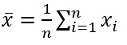{height="40px"}

mittlere quadratische Abweichung bzw. Standardabweichung:  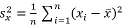{height="40px"} und 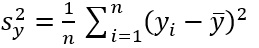{height="40px"}

Kovarianz:  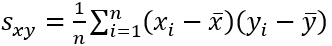{height="40px"}

Mit diesen Werten lassen sich dann a und b der Regressionsgeraden ermitteln, indem in die folgenden Formeln eingesetzt wird: 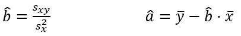{height="50px"}

Zur Schreibweise: Das Dachˆ über b bzw. über a weist darauf hin, dass es sich um Schätzer für die unbekannten Modellparameter b und a handelt.

Der in “Tab 1 - Definition und mathematisches Modell und Voraussetzungen“ erwähnte Fehler u ist für die Regressionsgerade nicht wichtig. 
Er ist wegen der Korrektheit der Formel wichtig, weil die Werte eben nicht immer auf der Regressionsgeraden liegen.

Programmieren SIe bitte ein ggPlot mit Konfidenzband für den Boston Housing Datensatz und benutzen Sie die Variable rm als unabhängige Variable und medv als abhändgige Variable.

```{r boston_ggP, exercise=TRUE, exercise.timelimit=5, exercise.blanks = "___+"}
___ <- data.frame(rm = boston_housing$rm, ___ = boston_housing$medv) # Data Frame auf Objekt übergeben
ggplot(___, aes(x = rm, y = medv)) + # Objekt laden
    geom_point(color = "blue", size = 2) +
    geom_smooth(method = "lm", color = "red", se = ___) + # se ist das Konfidenzband FALSE/TRUE
    labs(
        title = "Streudiagramm mit Regressionsgerade",
        x = "Durchschnittliche Anzahl der Räume (rm)",
        y = "Medianwert der Häuserpreise (medv)"
    ) + 
    theme_minimal()
```

```{r boston_ggP-solution, exercise.eval=FALSE, include=FALSE}
data <- data.frame(rm = boston_housing$rm, medv = boston_housing$medv)
ggplot(data, aes(x = rm, y = medv)) + 
    geom_point(color = "blue", size = 2) +
    geom_smooth(method = "lm", color = "red", se = TRUE) +
    labs(
        title = "Streudiagramm mit Regressionsgerade",
        x = "Durchschnittliche Anzahl der Räume (rm)",
        y = "Medianwert der Häuserpreise (medv)"
    ) + 
    theme_minimal()
```

An der Regressionsgeraden lässt sich ablesen, ob es einen Zusammenhang zwischen den Werten der x-Achse und denen der y-Achse gibt.

Dies kann man mit dem Bravais-Person Korrelationskoeffizient (r) genauer bestimmen.

Hat man einen signifikanten Beitrag der endogenen Variablen x zur Erklärung der Zielvariablen y festgestellt, 
kann man die Höhe des Beitrages quantifizieren. Die Maßzahl dafür heißt Determinationskoeffizient (r²). 
Genauer gibt der Determinationskoeffizient den Anteil der Variationen von y an, der durch den linearen Einfluss von x erklärbar ist.

Determinationskoeffizient:  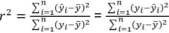{height="60px"}

Ein Determinationskoeffizient von 0,6 bedeutet, dass 60% der Werte der abhängigen Variablen y von der unabhängigen Variablen x erklärt werden können. 
Dementsprechend sind die restlichen 40% durch den Fehler u zu erklären.

Der Bravais-Person Korrelationskoeffizient ist die Kovarianz geteilt durch die Wurzel des Produkts von der Standardabweichung von x und der Standardabweichung von y.

Bravais-Person Korrelationskoeffizient: 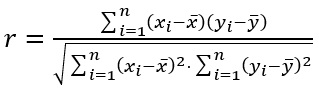{height="90px"}

Der Bravais-Person Korrelationskoeffizient (r) von +1 sagt, dass die Regressionsgerade eine Steigung hat und die Werte genau auf der Regressionsgeraden liegen und -1 bedeutet, dass die Regressionsgerade ein Gefälle hat und die Werte genau auf der Regressionsgeraden liegen. Der Determinationskoeffizient (r²) hingegen gibt Aufschluss, wie sehr die Werte auf der Regressionsgeraden liegen, sagt aber nichts über die Steigung aus.

```{r r_und_r2}
question("Ist der Korrelationskoeffizient r die Wurzel aus dem Determinationskoeffizient r²?",
  answer("Das ist wahr."),
  answer("Das ist falsch.", correct = TRUE),
  allow_retry = TRUE
)
```

Um mehrere Variablen Einfluss auf den y-Wert nehmen zu lassen, können diese weiteren Variablen in die Funktion {height="30px"} eingesetzt werden. Zum Beispiel durch das Einsetzen einer weiteren unabhängigen Variablen, heißt die Formel: 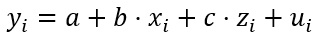{height="30px"}. Hier wurde 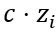{height="30px"} eingesetzt. Für {height="30px"} und 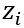{height="30px"} sind die Werte der unabhängigen Variablen einzusetzen und b und c sind die Faktoren für die Werte der unabhängigen Variablen, welche durch die Regressionsgeraden vorgegeben sind.

Bitte vervollständigen Sie den Code als ggplot.

```{r boston_zwei, exercise=TRUE, exercise.timelimit=5, exercise.blanks = "___+"}
___(boston_housing, aes(x = rm, y = medv)) + # Welchen Plot möchte ich starteb
    geom_point(aes(color = lstat), size = 2) +
    geom_smooth(
        method = "lm",
        formula = y ~ ___,
        aes(group = 1),
        se = ___, # Konfidenzband
        linewidth = 1 
    ) + 
    labs(
        title = "Multiple Regression: Vorhersage von medv basierend auf rm und lstat",
        x = "Durchschnittliche Anzahl der Räume (rm)",
        y = "Medianwert der Häuserpreise (medv)",
        color = "LSTAT (%)"
    ) + 
    theme_minimal()

```

```{r boston_zwei-solution, exercise.eval=FALSE, include=FALSE}
ggplot(boston_housing, aes(x = rm, y = medv)) + 
    geom_point(aes(color = lstat), size = 2) +  # Punkte mit lstat als Farbverlauf
    geom_smooth(
        method = "lm",
        formula = y ~ x,
        aes(group = 1),  # Gruppierung hinzufügen, um die Regressionsgerade korrekt zu zeichnen
        se = FALSE,
        linewidth = 1    # Statt size das neue linewidth-Argument verwenden
    ) + 
    labs(
        title = "Multiple Regression: Vorhersage von medv basierend auf rm und lstat",
        x = "Durchschnittliche Anzahl der Räume (rm)",
        y = "Medianwert der Häuserpreise (medv)",
        color = "LSTAT (%)"
    ) + 
    theme_minimal()

```

Wie sie sehen, haben sich die Werte in der Grafik, im Gegensatz zu dem Plot mit nur einer Variablen, nicht geändert. Es ist leider nicht möglich in R eine Grafik mit zwei unabhängigen Variablen als eine Regressionsgerade zu plotten. Statt dessen wurde der Einfluss der unabhängigen Variablen lstat in der Grafik farbig dargestellt.

Die Berechnung durch eine Summary ist aber möglich. Bitte ergänzen Sie den Code um die Summary für rm, lstat und medv zu starten. medv ist immer die abhängige Variable.

```{r boston_summary, exercise=TRUE, exercise.timelimit=5, exercise.blanks = "___+"}
# Lineares Regressionsmodell anpassen
model <- lm(___ ~ rm + ____, data = boston_housing)

# Zusammenfassung des Modells anzeigen
summary(___)
```

```{r boston_summary-solution, exercise.eval=FALSE, include=FALSE}
# Lineares Regressionsmodell anpassen
model <- lm(medv ~ rm + lstat, data = boston_housing)

# Zusammenfassung des Modells anzeigen
summary(model)
```

Der Standardfehler ist die Wurzel der Standardabweichung von x geteilt durch die Wurzel von n.

Standardfehler: 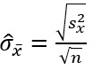{height="90px"}

```{r interceptor}
question_numeric("Wie lautet der Schnittpunkt mit der Y-Achse?",
  answer(-1.35827, correct = TRUE),
  allow_retry = TRUE
)
```

```{r steigung}
question_numeric("Wie groß ist der Anstieg von rm?",
  answer(5.09479, correct = TRUE),
  allow_retry = TRUE
)
```

Als Abschluss können Sie sich noch anschauen, wie sich der Fehlerwert verändert, wenn Sie die Regressionsgerade nach oben oder unter verschieben.

```{r}
fluidRow(
  column(8, 
         plotOutput("housing_plot"),     # Plot der Regressionsgeraden
         verbatimTextOutput("error_output")  # Fehleranzeige unter dem Plot
  ),
  column(4,
         sliderInput("slider_shift", "Verschiebung der Regressionsgeraden (nach oben/unten):",
                     min = -10, max = 10, value = 0, step = 0.1),  # Schieberegler
         plotOutput("error_plot")            # Fehlerplot rechts vom Hauptplot
  )
)
```

```{r, context="server"}
# Server-Code für interaktiven Inhalt
output$housing_plot <- renderPlot({
  # Boston Housing Daten laden
  data("Boston", package = "MASS")
  
  # Lineares Regressionsmodell für rm (Anzahl der Räume) und medv (Häuserpreise)
  model <- lm(medv ~ rm, data = Boston)
  
  # Schiebereglerwert auslesen
  shift <- input$slider_shift
  
  # Vorhersagen basierend auf dem Modell
  Boston$predicted <- predict(model, newdata = Boston)
  
  # Verschobene Regressionsgerade
  Boston$shifted <- Boston$predicted + shift
  
  # Plot generieren
  ggplot(Boston, aes(x = rm, y = medv)) +
    geom_point(alpha = 0.6) +
    geom_line(aes(y = predicted), color = "blue", linetype = "dashed", linewidth = 1) +
    geom_line(aes(y = shifted), color = "red", linewidth = 1) +
    labs(
      x = "Anzahl der Räume (RM)",
      y = "Median der Häuserpreise (MEDV)",
      title = "Boston Housing: RM vs. MEDV",
      subtitle = sprintf("Verschiebung der Regressionsgeraden: %.1f", shift)
    ) +
    theme_minimal()
})

output$error_plot <- renderPlot({
  # Boston Housing Daten laden
  data("Boston", package = "MASS")
  
  # Lineares Regressionsmodell für rm (Anzahl der Räume) und medv (Häuserpreise)
  model <- lm(medv ~ rm, data = Boston)
  
  # Fehlerberechnung über einen Bereich von Verschiebungen
  shifts <- seq(-10, 10, by = 0.1)
  mse_values <- sapply(shifts, function(shift) {
    predicted <- predict(model, newdata = Boston) + shift
    mean((Boston$medv - predicted)^2)
  })
  
  # Daten für Fehlerplot
  error_df <- data.frame(shift = shifts, mse = mse_values)
  
  # Fehlerplot erstellen
  ggplot(error_df, aes(x = shift, y = mse)) +
    geom_line(color = "darkred", linewidth = 1) +
    geom_vline(xintercept = input$slider_shift, linetype = "dashed", color = "blue") +
    labs(
      x = "Verschiebung der Regressionsgeraden",
      y = "Mittlerer quadratischer Fehler (MSE)",
      title = "Fehler durch Verschiebung der Regressionsgeraden",
      subtitle = sprintf("Aktuelle Verschiebung: %.1f", input$slider_shift)
    ) +
    theme_minimal()
})

output$error_output <- renderText({
  # Boston Housing Daten laden
  data("Boston", package = "MASS")
  
  # Lineares Regressionsmodell für rm (Anzahl der Räume) und medv (Häuserpreise)
  model <- lm(medv ~ rm, data = Boston)
  
  # Schiebereglerwert auslesen
  shift <- input$slider_shift
  
  # Vorhersagen mit Original- und verschobener Regressionsgerade
  Boston$predicted <- predict(model, newdata = Boston)
  Boston$shifted <- Boston$predicted + shift
  
  # Fehlerberechnung (Mittlere quadratische Abweichung)
  mse_original <- mean((Boston$medv - Boston$predicted)^2)
  mse_shifted <- mean((Boston$medv - Boston$shifted)^2)
  error_diff <- mse_shifted - mse_original
  
  # Fehlertext ausgeben
  paste0(
    "Fehler bei der verschobenen Regressionsgeraden:\n",
    sprintf("Originaler Fehler (MSE): %.2f\n", mse_original),
    sprintf("Verschobener Fehler (MSE): %.2f\n", mse_shifted),
    sprintf("Zusätzlicher Fehler: %.2f", error_diff)
  )
})
```

Wenn Sie sich bitte die Zeit nehmen und an der kurzen Umfrage zu diesem Lern-Dashboard teilnehmen.

Zugang zur Umfrage über den folgenden Link: https://forms.gle/rJaX17vkoQZUJzck7

::: data_protection_text
### Autor

Jürgen Willy Lässig

### Projekt

Lern-Dashboard über lineare Regression

### Datenschutz

Der Server des Lern-Dashboard sammelt statistische Daten über die Nutzung des Lern-Dashboard. Diese Daten werden nicht weitergegeben und enthalten keine personenbezogenen Informationen.

### Quellen

de.statista.com 2024. Definition Normalverteilung. https://de.statista.com/statistik/lexikon/definition/95/normalverteilung/ [Stand 2024-12-14].

Fahrmeir, Ludwig u. a. 2024. Statistik: Der Weg zur Datenanalyse. 9. Aufl. 2023. Berlin, Heidelberg: Springer Berlin Heidelberg.

Frost, Ira 2018. Einfache lineare Regression: Die Grundlage für komplexe Regressionsmodelle verstehen. Wiesbaden: Springer VS.

Rottmann, Horst & Auer, Benjamin R. 2010. Ein Überblick über die lineare Regression. WiSt - Wirtschaftswissenschaftliches Studium 39, 11, 548–554.
http://elibrary.vahlen.de/index.php?doi=10.15358/0340-1650-2010-11-548 [Stand 2024-11-29].

Sebastian 2023. Lineare Regression – Funktionsweise und Berechnung mit RStudio. https://www.acad-write.com/ratgeber/statistik-rstudio/lineare-regression-rstudio/ [Stand 2024-12-12].

Urban, Dieter & Mayerl, Jochen 2011. Regressionsanalyse: Theorie, Technik und Anwendung. 4., überabeitete und erweiterte Auflage. Wiesbaden: VS Verlag für Sozialwissenschaften.

Weiß, C. 2018. Lineare Regression: Folge 8. Notfall +  Rettungsmedizin 21, 5, 406–408. http://link.springer.com/10.1007/s10049-018-0473-0 [Stand 2024-12-1].

ChatGPT für die Übersicht des Boston Housing Datensatzes und als Hilfe beim Programmieren des R Code
:::
